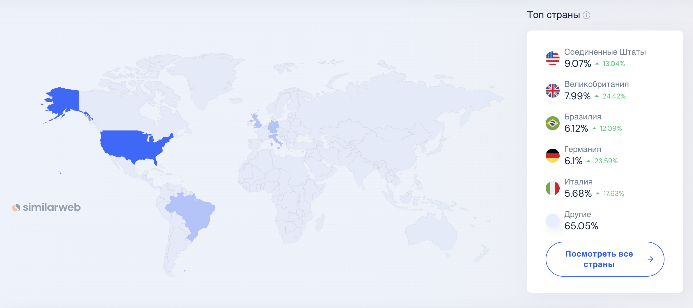
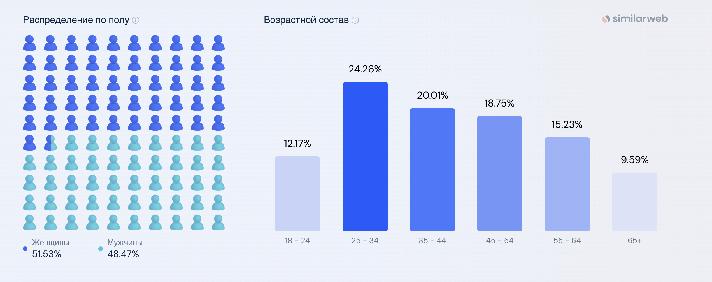
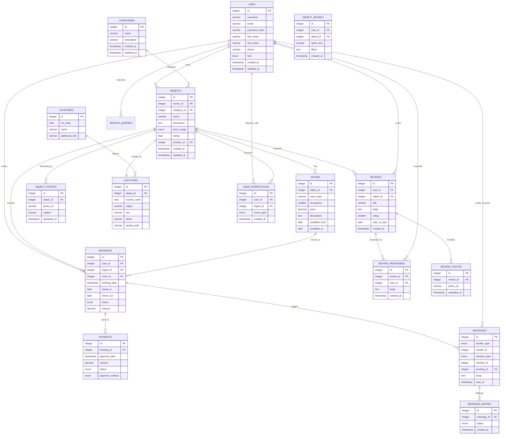
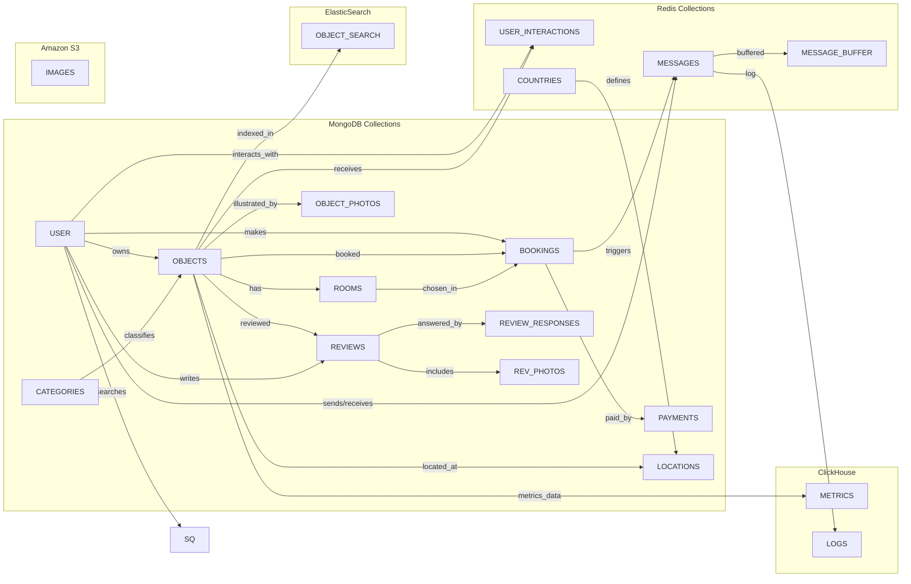

# Booking.com

## Содержание

- [Booking](#booking)
  - [Содержание](#содержание)
  - [Основная часть](#основная-часть)
    - [1. Тема и целевая аудитория](#1-тема-и-целевая-аудитория)
      - [Функционал MVP](#функционал-mvp)
      - [Целевая аудитория](#целевая-аудитория)
        - [Анализ трафика и вовлеченности](#анализ-трафика-и-вовлеченности)
        - [Веб-трафик по странам](#веб-трафик-по-странам)
        - [Демографические показатели](#демографические-показатели)
  - [Список источников](#список-источников)

## Основная часть

### 1. Тема и целевая аудитория

**Booking** - система интернет-бронирования отелей.

#### Функционал MVP

1. Регистрация и авторизация пользователей
2. Поиск
3. Бронирование жилья
    - Создание бронирования: форма бронирования, подтверждение на email
    - Редактирование дат бронирования (в рамках доступных)
    - Отмена бронирования
4. Кабинет владельца жилья: 
    - Размещение и редактирование объявления (фото, описание, удобства, цена, тип проживания, раcположение на карте, доступные даты)
    - Управление доступными датами
5. Кабинет пользователя:
    - Просмотр текущих бронирований
6. Добавление отзывов об объекте размещения
7. Чат между владельцем жильца и бронирующим
8. Система оплаты бронирований

#### Фичи

1. Интерактивная карта с объектами размещения
2. Система напоминаний и уведомлений
3. Поддержка гибких условий бронирования
4. Просмотр истории бронирований

#### Целевая аудитория

##### Анализ трафика и вовлеченности

- всего посещений (за месяц): **520.4M** [^1]
- доля пользователей, покинувших сайт после просмотра одной страницы: **33.14%** [^1]
- страниц на посещение: **8.23** [^1]
- средняя продолжительность посещения: **00:08:27** [^1]
- **`>120`** млн активных пользователей в месяц [^2]
- **`>1B`** ночей проживания бронируется через букинг в год [^2]

##### Веб-трафик по странам

 [^2]

##### Демографические показатели

 [^2]

### 2. Расчет нагрузки

#### 1. Продуктовые метрики

1.1. Аудитория

- **MAU (Monthly Active Users):** ориентировочно **400–500 млн**  

- **Пиковый DAU (Daily Active Users):** условно ~**20 млн**    

1.2. Среднее количество действий (в день, на 1 пользователя)

По официальным данным Booking Holdings, в 2022 году через их сервисы было забронировано свыше **900 млн room nights**. Делим условно эту цифру на несколько сотен миллионов активных пользователей, понимаем, что:

- **Брони** в среднем у активного пользователя 1–3 раза в год.  
- В процессе выбора жилья на 1 визит может приходиться несколько **поисков** и **просмотров** (другие объекты).

Для упрощённого расчёта, на **1 пользователя в «пиковые» сутки** возьмём следующее:

| **Действие**                       | **Кол-во в день (на пользователя)** | **Откуда цифра**                                                  |
|:-----------------------------------|:------------------------------------:|:-------------------------------------------------------------------|
| **Поиск** (города, даты, фильтры) | 10                                   | Пользователь обычно многократно меняет фильтры и даты.            |
| **Просмотр карточек отелей**       | 15                                   | При подборе жилья просматривают 10–20 вариантов.                  |
| **Создание/изменение брони**       | 0,1                                  | По статистике, не каждый день, но 1 раз в 10 дней — усреднённо.    |
| **Отзывы** (написать/прочитать)    | 0,2                                  | Меньшая часть пользователей пишет отзывы, многие — только читают. |
| **Сообщения** (чат с отелем)       | 0,2                                  | Вопросы о заселении, дополнительной информации и т.п.             |

Итого получается **~25–26 действий** на одного «действительно активного» пользователя.  

---

#### 2. Объём данных на одного пользователя

2.1. Долгосрочное хранение (за год)

| **Категория**                                          | **Оценка размера (1 пользователь за год)** | **Комментарий**                                                                                 |
|:-------------------------------------------------------|:------------------------------------------:|:-------------------------------------------------------------------------------------------------|
| **Профиль** (аватар, контакты, платёжные данные)       | ~0,5 МБ                                     | Данные учётки                                             |
| **История бронирований** (1–3 в год)                    | ~0,3 МБ                                     | Информация о транзакциях, чеки, подтверждения.                                |
| **Отзывы** (1 раз в год + метаданные)                  | ~0,1 МБ                                     | Текст отзыва + метаданные (оценка). Реже фотографии.     |
| **Сообщения** (в чате)                                 | ~0,05 МБ                                    | Небольшой текст, изредка вложения (скрин, PDF).                                                  |
| **Рекомендации, избранное**                            | ~3 МБ                                       | Кеш подборок жилья, списки «Избранное».                                              |

**Итого:** \~4 МБ на пользователя в год (0,5 + 0,3 + 0,1 + 0,05 + 3 = 3,95 ≈ 4).  

### 2.2. Сетевой трафик (за сутки, «пиковый» пользователь)

1. **Поиск** — \~0,7 МБ на 1 запрос (HTML, миниатюры фото).  
2. **Просмотр отеля** — \~2 МБ на 1 просмотр (карточка, фото, отзывы).  
3. **Создание/изменение брони** — \~0,5 МБ.  
4. **Отзыв** (просмотр/написание) — \~0,3 МБ.  
5. **Сообщение** — \~0,1 МБ.
6. **Авторизация/Регистрация** — \~0,05 МБ.  
7. **Управление объявлениями** — \~1 МБ.  

Тогда:

| **Действие**       | **Кол-во** | **Объём на 1 действие (МБ)** | **Итого на 1 пользователя/день (МБ)** | **Итого на 1 пользователя/день (Гбит/с)** |
|:-------------------|-----------:|-----------------------------:|---------------------------------------:|------------------------------------------:|
| Поиск              | 10         | 0,7                         | 7                                     | \(\frac{7 \times 8}{86400} \approx 0,00065\) |
| Просмотр отеля     | 15         | 2                           | 30                                    | \(\frac{30 \times 8}{86400} \approx 0,00278\) |
| Бронирование       | 0,1        | 0,5                         | 0,05                                  | \(\frac{0,05 \times 8}{86400} \approx 0,0000046\) |
| Отзывы             | 0,2        | 0,3                         | 0,06                                  | \(\frac{0,06 \times 8}{86400} \approx 0,0000056\) |
| Сообщения          | 0,2        | 0,1                         | 0,02                                  | \(\frac{0,02 \times 8}{86400} \approx 0,0000019\) |
| Авторизация/Регистрация | 0.1   | 0,05                        | 0,005                                 | \(\frac{0,005 \times 8}{86400} \approx 0,00000046\) |
| Управление объявлениями | 0,1   | 1                           | 0,1                                   | \(\frac{0,1 \times 8}{86400} \approx 0,0000093\) |
| **Итого**          | —          | —                           | **37,235**                            | **\(\approx 0,0028\)** |

#### 3. Итог

3.1. Общий объём хранения

1. **Персональные данные** (данные пользователей):  

    500млн×4МБ=2000ТБ=2ПБ.  

2. **Данные об отелях**:  
   - 28+ млн активных объявлений.  
   - Каждое объявление может иметь десятки высококачественных фото, описания, отзывы и т.п.  
   - Итого получается **десятки–сотни ПБ**.

3. **Исторические логи, транзакции, бэкапы**:  
   - Booking Holdings сообщала, что было свыше 900 млн ночей (room nights) забронировано за год, и это хранится для отчётности, аналитики и юридических целей.  
   - С учётом логов и резервных копий речь идёт о **десятках ПБ**.

4. **Объявления**:  
   - Включает текстовые данные, фотографии, и метаданные для каждого объявления.
   - Оценка: **десятки ПБ**.

3.2. Сетевой трафик

Возьмём **DAU = 20 млн** (пиковый день) × **37,235 МБ** на пользователя:

20млн×37,235МБ=744,7млн МБ=744700ГБ=0,745ПБ/сутки

Перевод в Гбит/с:

0,745 \times 1024 \times 8}{86400} \approx 70,5 \text{ Гбит/с}

Этот объём (**\~70,5 Гбит/с**) — упрощённая оценка «внешнего» трафика с пользовательских устройств. Часть отдается через CDN, есть внутренний трафик между микросервисами, базы данных и т.д., поэтому реальный суммарный network footprint у Booking.com выше.

3.3. RPS (Requests Per Second)

На 20 млн DAU и \~25,7 действий в день на 1 пользователя получаем:

25,7×20млн=514млн запросов/сутки≈ 514млн/86400≈5949RPS (в среднем)

**Разбивка по типам**:

| **Запрос**                 | **Суточное кол-во** | **Средний RPS** | **Пиковый RPS**    | **Комментарии**                                              |
|:---------------------------|---------------------:|----------------:|--------------------:|:-------------------------------------------------------------|
| **Поиск**                  | 200 млн             | ~2 300          | ~6900            | Списки отелей, фильтры и сортировки                          |
| **Просмотр отеля**         | 300 млн             | ~3 470          | ~12000            | Загрузка фото, отзывов, описаний                             |
| **Создание/изменение брони** | 2 млн              | ~23             | ~69               | Транзакции, оплата (наиболее «тяжёлые» для БД)               |
| **Отзывы**                 | 4 млн               | ~46             | ~120               | Чтение/написание отзывов                                     |
| **Сообщения (чат)**        | 4 млн               | ~46             | ~120               | Текстовые вопросы к отелю/службе поддержки                   |
| **Авторизация/Регистрация**| 2 млн               | ~23             | ~69               | Вход и создание новых учётных записей                        |
| **Управление объявлениями**| 2 млн               | ~23             | ~69               | Создание и редактирование объявлений                         |
| **Итого**                  | ~514 млн            | **~5 949**      | **~19000**        | Пиковые часы (вечер, праздники, акции)|

### 3. Глобальная балансировка нагрузки

- **Большое число пользователей по всему миру**  
  По данным SimilarWeb, на Booking.com ежемесячно заходит **более 500 млн** посетителей. Значимая доля трафика (до 40%) идёт из Европы, около 15–20% из Северной Америки, 15–25% из Азии и т.д.  

В таблице приводятся **примерные** доли по регионам (на основе открытых данных SimilarWeb, BusinessOfApps и внутренних оценок), основные страны, а также предлагаемая точка размещения одного или двух дата-центров на регион.

| **Регион**            | **Примерная доля трафика** | **Крупнейшие страны**                               | **Предлагаемые локации**                                          | **Основные аргументы**                                                                                                                                                                                        |
|-----------------------|:--------------------------:|----------------------------------------------------|--------------------------------------------------------------------|---------------------------------------------------------------------------------------------------------------------------------------------------------------------------------------------------------------|
| **Северная Америка**  | ~15–20%                   | США, Канада, Мексика                              | **Восток**: Нью-Йорк / Вирджиния - **Запад**: Лос-Анджелес / Сиэтл | - Высокая платёжеспособность и активность - 1 DC на востоке, 1 на западе снижают задержки для всего континента - Широкие каналы связи с Европой и Азией                                                   |
| **Европа**            | ~35–40%                   | Великобритания, Германия, Франция, Италия, Испания, Нидерланды, Польша | **Амстердам** (историческая локация Booking) | - Самый крупный сегмент пользователей Нужна низкая латентность для быстрого поиска                   |
| **Азия**              | ~15–25%                   | Япония, Китай, Индия, Юго-Восточная Азия           | **Сингапур** (Дополнительно: Токио)    | - Огромное население и рост туризма Ускоренный доступ для пользователей из стран АТР - Актуально актив-актив репликация, чтобы обрабатывать бронирования локально                                      |
| **Латинская Америка** | ~10%                      | Бразилия, Мексика, Аргентина, Чили                | **Сан-Паулу** или **Мехико**                     | - Растущая доля рынка Ускоренное обслуживание стран Латинской Америки Уменьшение задержек при поиске и оплате бронирований                                                                           |
| **Африка**            | ~5%                       | Египет, ЮАР, Нигерия, Марокко                      | **Каир** (Север Африки) или **Йоханнесбург** (ЮАР) | - Пока небольшой, но перспективный рынок - Египет — одно из популярных туристических направлений (пляжный и культурный туризм) Локальный DC снижает задержки и даёт резерв для глобального покрытия      |

> **Итого**:  
> - **7 основных дата-центров**: США (2 шт), Европа (2 шт), Азия (1 или 2 шт), Латинская Америка (1), Африка (1).  
> - При дальнейшем росте можно добавлять дополнительные узлы или POP-точки.

Итак, ДЦ можно раположить в следующих городах (с учетом расположения, коммуникационных кабелей и распределения населения в мире):

- США: Нью-Йорк, Сиэтл
- Великобритания: Манчестер
- Россия: Москва
- ЮАР: Кейптаун (рядом с АЭС)
- Аргентина: Буэнос-Айрес (рядом с АЭС)

DNS-балансировка:
Для балансировки выбрана Geo-based DNS, поскольку изначально точки размещения дата-центров подбирались с учетом плотности пользователей в различных регионах. Кроме того, GeoDNS дешевле и проще в поддержке, чем Latency-based DNS, так как не требует сложных механизмов мониторинга сетевых задержек.

Anycast-балансировка:
Для обеспечения отказоустойчивости внутри каждого региона (США, Европа, остальной мир) будет использоваться балансировка на уровне роутинга, которая позволит направлять трафик к доступному серверу в случае, если один из серверов в регионе окажется недоступен.

В США: Anycast между двумя серверами в Нью-Йорке и Сиэтле.
Аналогично, в зоне Европы: Anycast между серверами в Манчестере и Москве.
В остальных регионах: Anycast между серверами в Кейптауне и Буэнос-Айресе.

### 4. Локальная балансировка нагрузки

После того как глобальные DNS- и Anycast-балансировки распределили трафик по дата-центрам, следующим шагом становится локальная балансировка внутри каждого центра. Здесь ключевая задача – равномерно распределить входящие запросы между серверами и обеспечить отказоустойчивость системы.

Балансировка входящих запросов
Для обработки внешних запросов Booking.com применяет балансировку на уровне приложений (L7) с помощью NGINX. Причины выбора этого решения:

- Высокая производительность: NGINX отлично справляется с большим числом одновременных соединений, при этом умеет кэшировать статический контент (например, изображения отелей или отзывы). Это помогает ускорить ответы и снизить нагрузку на бэкенд-серверы.

- SSL-терминация:
Шифрованный HTTPS-трафик расшифровывается уже на балансировщике. Это позволяет серверам работать с уже расшифрованными данными и экономить вычислительные ресурсы, даже если на установление одного SSL-соединения уходит около 2 мс CPU-времени и 2 КБ сетевого трафика.

- Гибкость настройки:
NGINX можно легко адаптировать под конкретные потребности инфраструктуры. В нашем случае используется алгоритм Round Robin, который равномерно распределяет запросы между серверами при условии однородной нагрузки.

- Интеграция с Kubernetes:
Автоматическое масштабирование позволяет добавлять новые серверы по мере роста нагрузки. NGINX сразу же начинает направлять трафик на новые инстансы, что повышает отказоустойчивость системы.

Чтобы избежать единой точки отказа, в каждом дата-центре развёртывают не один, а два экземпляра NGINX. Между ними реализована балансировка на уровне сети (L3) с использованием метода Direct Routing – это позволяет уменьшить задержки, так как обратный трафик не проходит через балансировщик.

**Балансировка межсервисных запросов**
Внутренний обмен данными между микросервисами происходит через Envoy:

- Алгоритм Least Connections:
Новый запрос направляется к тому серверу, где в данный момент меньше активных соединений, что позволяет избежать перегрузок.

- Отказоустойчивость:
Для повышения надёжности в каждом дата-центре развёртываются два экземпляра Envoy. Если один из них выходит из строя, трафик автоматически перенаправляется на другой.

- Direct Routing:
Трафик между сервисами распределяется на уровне сети, что минимизирует задержки.

- Оценка нагрузки при SSL-терминации
При установлении нового SSL-соединения затрачиваются:
CPU: около 2 мс на соединение.
Сетевой трафик: примерно 2 КБ на соединение.

Если рассматривать пиковую нагрузку (например, до 19 000 запросов в секунду), то для одного балансировщика:

Нагрузка на CPU: 19 000 × 0.002 = 38 секунд CPU в секунду (эта нагрузка делится между несколькими балансировщиками).

Нагрузка на сеть: 19 000 × 2 КБ = 38 000 КБ/сек, или около 38 МБ/сек.

### 5. Логическая схема БД

**1. Общая схема и ключевые сущности**

**Размер хранимых данных рассчитаем исходя из размеров используемых типов:**

- **integer:** 4 байта 
- **smallint:** 2 байта  
- **varchar(n):** в среднем 128 байт (с учетом 1–2 байт на хранение длины; отдельные поля, такие как текст отзыва – 256, ответ на отзыв – 256, био профиля – 512, название роли – 32, описание объекта – 512, имя категории – 32)  
- **timestamp:** 8 байт  
- **date:** 3 байта  
- **enum:** 4 байта

**Примерная оценка для каждой таблицы**  

| Таблица               | Описание                                                   | Средний размер записи | Общий объём данных (≈)                              |
|-----------------------|------------------------------------------------------------|-----------------------|----------------------------------------------------|
| **USER**              | Пользователи сервиса (включая владельцев и клиентов)       | 596 байт              | 80 млн × 0.596 КБ ≈ **47,7 ГБ**                     |
| **CATEGORIES**        | Категории объектов (например, «Отель», «Апартаменты»)       | 84 байта              | 10 × 0.084 КБ ≈ **0,84 КБ**                         |
| **OBJECTS**           | Объекты размещения                                         | 708 байт              | 8 млн × 0.708 КБ ≈ **5,7 ГБ**                       |
| **ROOMS**             | Варианты номеров с периодами доступности                   | 280 байт              | 8 млн × 3 × 0.280 КБ ≈ **6,7 ГБ**                   |
| **BOOKINGS**          | Записи о бронированиях                                     | 42 байта              | 500 млн × 0.042 КБ ≈ **21 ГБ**                      |
| **PAYMENTS**          | Транзакции по бронированиям                                | 32 байта              | 500 млн × 0.032 КБ ≈ **16 ГБ**                      |
| **REVIEWS**           | Отзывы клиентов                                            | 409 байт              | 1 млрд × 0.409 КБ ≈ **409 ГБ**                      |
| **REVIEW_RESPONSES**  | Ответы владельцев на отзывы                                | 276 байт              | 100 млн × 0.276 КБ ≈ **27,6 ГБ**                    |
| **REVIEW_PHOTOS**     | Фотографии к отзывам                                       | 144 байта             | 160 млн × 0.144 КБ ≈ **23,0 ГБ**                    |
| **OBJECT_PHOTOS**     | Фотографии объектов                                        | 176 байт              | 80 млн × 0.176 КБ ≈ **14,1 ГБ**                     |
| **LOCATIONS**         | Адреса объектов                                            | ~392 байта            | 8 млн × 0.392 КБ ≈ **3,1 ГБ**                       |
| **COUNTRIES**         | Справочные данные по странам                               | 71 байт               | ~250 × 0.071 КБ ≈ **18 КБ**                         |
| **MESSAGES**          | Чат‑сообщения                                              | 212 байт              | ~10 млн × 0.212 КБ ≈ **2,1 ГБ**                     |
| **OBJECT_SEARCH**    | История поисковых запросов                                 | ~400 байт             | ~200 млн × 0.400 КБ ≈ **80 ГБ**                     |
| **USER_INTERACTIONS** | Логи просмотров/кликов/сохранений для рекомендаций         | ~52 байта             | ~500 млн × 0.052 КБ ≈ **26 ГБ**                     |
| **MESSAGE_BUFFER**    | Буфер для гарантированной доставки сообщений               | ~48 байт              | ~10 млн × 0.048 КБ ≈ **0,5 ГБ**                     |

---

**Нагрузка на чтение и запись (RPS)**  

| Таблица               | Средняя нагрузка на чтение (RPS)               | Средняя нагрузка на запись (RPS) |
|-----------------------|-----------------------------------------------|----------------------------------|
| **USER**              | ~2 083                                        | ~1.4                             |
| **REVIEWS**           | ~2 602                                        | ~0.5                             |
| **REVIEW_RESPONSES**  | ~200                                          | ~0.005                           |
| **REVIEW_PHOTOS**     | ~347                                          | ~0.08                            |
| **OBJECTS**           | ~693                                          | ~0.042                           |
| **OBJECT_PHOTOS**     | ~693                                          | ~0.42                            |
| **BOOKINGS**          | ~250                                          | ~50–100                          |
| **PAYMENTS**          | постоянное чтение                             | ~50–100                          |
| **MESSAGES**          | ~50–100                                       | ~30–50                           |
| **OBJECT_SEARCH**    | ~2 300                                        | ~2 300                           |
| **USER_INTERACTIONS** | ~3 470                                        | ~5–10                            |
| **MESSAGE_BUFFER**    | минимальное (внутренний буфер)                | ~30–50                           |

**Требования для отдельных таблиц**
- USER: 
   - Поля username и email должны быть уникальными.
   - Поля username, email и password_hash не могут быть пустыми.
   - Поле role должно содержать одно из предопределённых значений (например, 'owner' или 'customer').

- CATEGORIES:
  - Поле name не может быть пустым.
  - Поле description (если используется) должно соответствовать заданному формату.

- OBJECTS:
  - Поля name и category_id (ссылка на CATEGORIES) не могут быть пустыми.
  - Поле price_range должно принимать только предопределённые значения (например, "Free", "$", "$$", "$$$").

- ROOMS:
  - Поле room_type не может быть пустым.
  - Периоды доступности (available_from и available_to) должны быть корректными датами (например, available_from ≤ available_to).

- BOOKINGS: 
   - Поля user_id, object_id и booking_date не могут быть пустыми.
  - Даты заезда (check_in) и выезда (check_out) должны быть валидными и соответствовать бизнес-логике (например, check_in ≤ check_out).

- PAYMENTS:
  - Поле booking_id должно ссылаться на существующую запись из BOOKINGS.
  - Поля payment_date, amount, status и payment_method не могут быть пустыми.

- REVIEWS:
  - Поля title и body не могут быть пустыми.
  - Дата пребывания (date_of_stay) должна быть ранее или равной дате создания отзыва (created_at).
  - Поле user_id должно ссылаться на клиента, оставившего отзыв, а object_id – на существующий объект.

- EVIEW_RESPONSES:
  - Поле body не может быть пустым.
  - Поля review_id и user_id (где пользователь с ролью owner) должны ссылаться на существующие записи в таблицах REVIEWS и USER соответственно.

- REVIEW_PHOTOS:

  - Поле photo_url не может быть пустым.
  - Поле review_id должно ссылаться на существующий отзыв.

- OBJECT_PHOTOS:

  - Поле photo_url не может быть пустым.
  - Поле object_id должно ссылаться на существующий объект.

- LOCATIONS:

  - Поля, описывающие адрес (например, city, street) не могут быть пустыми, если они обязательны для бизнес-логики.
  - Поле object_id должно ссылаться на существующий объект.

- COUNTRIES:

  - Поля iso_code и name не могут быть пустыми.

**Общие требования к консистентности**

**Внешние ключи:**
Все внешние ключи должны ссылаться на существующие записи в связанных таблицах. При удалении записи, на которую ссылается внешний ключ, необходимо обеспечить каскадное удаление или обновление всех связанных записей (либо использовать ограничения ON DELETE RESTRICT, если удаление запрещено).

**Атомарность транзакций:**
Операции, затрагивающие несколько таблиц (например, создание бронирования и соответствующего платежа), должны выполняться в рамках транзакций для обеспечения целостности данных.

**Проверка значений:**
Поля, содержащие перечисления (enum), должны принимать только допустимые значения.
Текстовые поля, требующие определённого объёма данных (например, описание объекта, отзывы), должны проверяться на допустимую длину.

**Консистентность дат:**
Даты, такие как check_in/check_out для бронирований, date_of_stay для отзывов и периоды доступности в ROOMS, должны быть логически связаны (например, дата заезда не может быть позже даты выезда).

### 6. Физическая схема БД

**Денормализация**

Нормализованная схема БД представлена в разделе 5. Необходима денормализация, так как в текущей схеме много сложных JOIN-ов. Это может привести к:

- Высоким расходам ресурсов на чтение и агрегацию данных.  
- Замедлению отклика при больших объёмах нагрузки.  
- Усложнению или даже невозможности эффективного шардинга.

1. **Коллекция USER**  
   - Вместо отдельной коллекции для ролей (owner, customer) поле role_name хранит роль напрямую.  
   - Так как набор ролей статичен, это избавляет от JOIN (или дополнительных запросов) для определения роли.  

2. **Коллекция REVIEWS**  
   - Поле user_name (или user_display_name) позволяет быстро выводить имя автора отзыва без обращения к USER.  
   - Поле object_name дублирует название объекта размещения, упрощая отображение отзывов с именем объекта.  
   - Массив responses (если нам нужно сразу получать ответы на отзывы) и photos (ссылки на изображения) может храниться прямо в документе отзыва. Это означает, что при получении одного отзыва сразу доступны все ответы и фото, без дополнительных запросов.

3. **Коллекция OBJECTS**  
   - Вместо category_id (с отсылкой к CATEGORIES) хранится category_name. Так мы мгновенно видим категорию объекта (например, «Отель», «Хостел»).  
   - country_name и locality_name (город/регион) могут храниться внутри объекта, чтобы быстро отображать основные данные о локации. Дополнительная детальная информация (street, postal_code, add_info) может по-прежнему находиться в коллекции LOCATIONS (или быть вынесена в отдельное поле address), если она нужна реже.  
   - Поле photos — массив JSON-объектов, содержащих ссылки на изображения и их описание. Это упрощает быстрый вывод всех фото объекта.

4. **Коллекция RECOMMENDATIONS**  
   - Хранение заранее сгенерированных рекомендаций с полями, «указывающими» на объекты. При выдаче результатов личного кабинета пользователя можно сразу подтянуть короткую информацию об объектах (их названия, краткие описания), без дополнительных запросов к OBJECTS.

**Выбор СУБД и шардирование**

# Диаграмма коллекций и баз данных Booking.com

1. **MongoDB** (основная БД)  
   - Коллекции:  
     - **users** (информация о пользователях)  
     - **objects** (объекты размещения)  
     - **reviews** (отзывы)  
     - **recommendations** (хранение данных рекомендаций)  
     - **messages** (чат, если нужно хранить в JSON‑формате)  
   - **Шардирование**:  
     - По возможности по полю, часто используемому для фильтрации, например, **object_id** (для reviews) или **user_id** (для messages).  
     - MongoDB хорошо масштабируется горизонтально (Sharding), что важно при объёмах Booking.com.  
   - **Репликация**:  
     - Replica Set для отказоустойчивости и проведения бэкапов.  

2. **Redis** (кэш, сессии, «быстрые» структуры)  
   - Хранение:  
     - **sessions** (короткоживущие данные о сессиях)  
     - **object_search_cache** (промежуточные результаты поисковых запросов)  
     - **countries** (небольшой справочник стран, доступный мгновенно)  
   - **Шардирование**: при необходимости большой нагрузки можно шардировать Redis по ключу.  
   - **Резервирование**: Redis позволяет хранить RDB-снимки (RDB snapshot) и вести AOF‑лог (Append‑Only File).

3. **ClickHouse** (для аналитики и логов)  
   - Хранение:  
     - **metrics** (события пользователей — клики, просмотры).  
     - **logs** (все серверные логи, технические события).  
   - Отлично подходит для колоночного хранения и высокоскоростной аналитики.  
   - **Шардирование**: по event_type (или по дате), в зависимости от сценария.  
   - **Резервное копирование**: с помощью `clickhouse-backup` или встроенных механизмов ClickHouse.

4. **Amazon S3** (файлы)  
   - **images** — вся мультимедиа (фото, иногда видео).  
   - S3 настраивается для надёжного хранения, масштабируется по требованию, есть встроенные инструменты для репликации и бэкапов.

5. **ElasticSearch** (поиск)  
   - **object_search** — индексы для быстрого текстового поиска по объектам, геопоиск, синонимы, автодополнение и пр.  
   - Позволяет делать сложные запросы (фильтрация, full-text) с высокой скоростью.

**Денормализованная структура**

**users (MongoDB)**  
- `role_name` вместо внешнего ключа на роли.  
- Минимизация JOIN: все необходимые для отображения поля (например, статистика пользователя) могут храниться прямо в документе.

**reviews (MongoDB)**  
- `username`, `object_name` дублируются в каждом документе отзыва, чтобы не делать JOIN по объектам / пользователям.  
- `responses` — массив ответов владельцев (вместо отдельной коллекции), если нужно мгновенно выводить всю ветку.  
- `photos` — массив ссылок на фотографии отзыва.

**objects (MongoDB)**  
- `category_name` вместо category_id.  
- `country_name`, `locality_name` (город, регион) часть полей из `locations`.  
- `photos` — массив JSON-объектов с сжатыми (thumbnail) и оригинальными ссылками на изображения.

**recommendations (MongoDB)**  
- Хранит «пакеты» рекомендаций на пользователя: список объектов, короткие описания, ссылки на фото, рейтинг и т.д. При показе рекомендации не нужно делать доп. запросы.

**Шардирование**  
- В MongoDB распределяем по полям, которые часто фигурируют в запросах (object_id для reviews, user_id для рекомендаций и сообщений).  
- Redis: по ключам.  
- ClickHouse: по дате / по типу события.  
- S3/ES: автодетект/встроенные механизмы.

**Индексы**

- **MongoDB**:  
  - `users`: индекс по `username`, `email` (уникальные).  
  - `reviews`: индекс по `object_id`, `created_at`.  
  - `objects`: индекс по `owner_id`, `category_name`.  
  - `messages`: индекс по `booking_id`, `created_at`. 
  - `recommendations`: индекс по `user_id`.  

- **Redis** обычно использует ключ/значение, индексы не характерны, если не использовать Redis Search.  
- **ClickHouse**: партиционирование и сортировка по дате или типу события.  
- **ElasticSearch**: анализаторы текста, поля для full‑text и геопоиска.

**Схема резервного копирования**

- **MongoDB**:  
  - ReplicaSet + периодические дампы (mongodump). При больших объёмах — oplog backup, Point-in-Time Recovery средствами облачных провайдеров.  
- **Redis**:  
  - RDB‑снимки и AOF‑логи. Снимки можно складывать в S3 или другое сетевое хранилище.  
- **ClickHouse**:  
  - Utility или бэкапы средствами обёрток Kubernetes.  
- **S3**:  
  - Встроенные механизмы версионности (Versioning) и регулярных бэкапов в AWS Backup.  
- **ElasticSearch**:  
  - Snapshot/Restore: делаем снепшоты кластера в репозиторий (S3, HDFS, etc.).

## Список источников

1. [Анализ веб-трафика booking.com](https://www.similarweb.com/ru/website/booking.com)

2. [Статистика Booking за 2023 год](https://www.businessofapps.com/data/booking-statistics/)

3. [https://ir.bookingholdings.com/financials/sec-filings/default.aspx](https://ir.bookingholdings.com/financials/sec-filings/default.aspx) 

4. [https://news.booking.com/](https://news.booking.com/)  

5. https://www.geopostcodes.com/blog/best-practices-storing-addresses/#:~:text=How%20can%20I%20store%20addresses,postal%20code%2C%20and%20country%20name.

